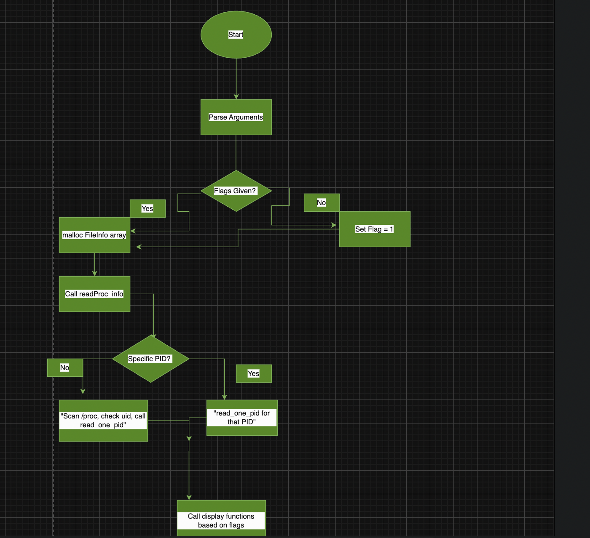
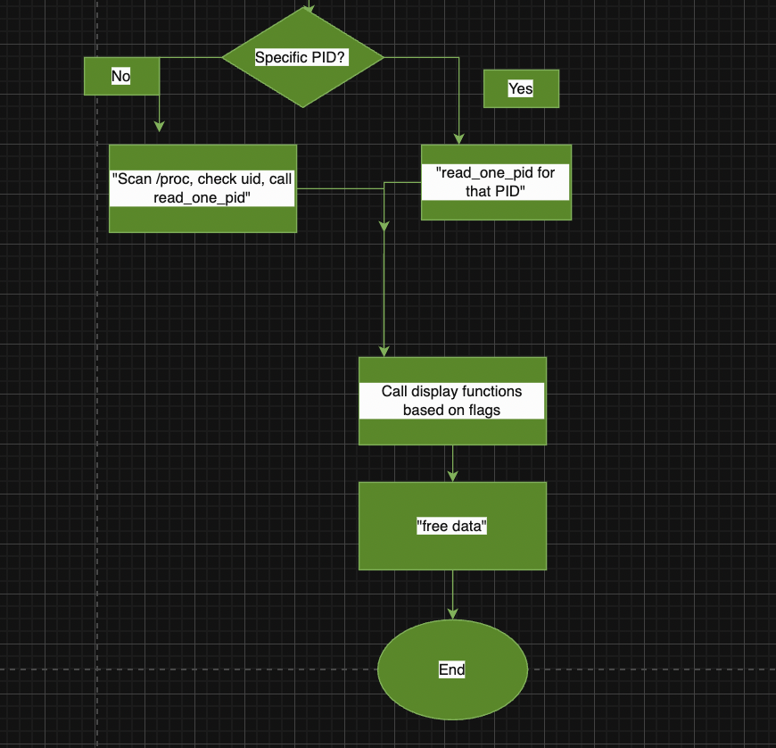

# CSCB09 Recreating the System-Wide FD Tables

## Metadata

- **Author:** Niveetha Sivakaran
- **Date:** 03/11/2026
- **Release/Version:** Final Submission

## Introduction

This assignment is about reading information from `/proc`, which is a virtual filesystem, to display the file descriptors that are currently being used by opened processes. The program then displays the information in different tables depending on the arguments given by the user.

## Description of Solution to the Problem

I approached the solution to this problem by first understanding the structure of the `/proc` filesystem and how the information is stored there. It was seen that each process has a directory identified by the PID, and a subdirectory inside that is connected through `fd`. There are links to the files that are opened by the processes.

The first step I knew to do was to figure out how to read one process before handling multiple processes. I did some research and found that we can use `opendir()` and `readdir()` to loop through the directory connected to `fd` and then use something called `readlink()` to get the filename of each entry. This gave me the filename column.

Then I was trying to figure out how to get the inode number. I first tried using something called `lstat()` to get the inode number. However, I realized this was giving me the inode number of the symbolic link and not the actual file. After some research, I found out that inode numbers in the `/fd` directory are stored by first starting with `"ino:"`. So, I created a helper function to open the file and read each line, find the `"ino:"`, and then retrieve it.

To handle all the user processes, through some research I realized I can scan the `/proc` directory and check which data entries are integers to see if they are PIDs. Then I used `stat()` to check the owner of each process by comparing `st_uid` to `getuid()`.

One problem I had was with dynamic memory. I was using `realloc()` to increase the size of the array that stored the file information, but the pointer was not updating properly. After researching, I learned I needed to use a double pointer `FileInfo **data` so that when the array grows, the pointer gets updated too.

## Implementation

### i. How to Implement the Code

I started by handling the command-line arguments in `main()` so we can determine which FD table the user wanted to be displayed. I parsed through the arguments `argc` and `argv` using a `for` loop and checked each argument using `strcmp()` and `strncmp()`.

I checked for the flagged arguments like `--per-process`, `--Vnodes`, and so on, and I set the flags to 1 if the argument was found. For `--threshold=X`, I used `strncmp()` and compared `--threshold=` and then used `atoi()` to get the number `X`. If an argument did not start with `-`, I treated it as the PID. I also added checks to make sure the threshold is not negative and the PID is a positive number.

If no flags were given at all, I then chose to show the default behavior, which was displaying the composite table.

The second step was then to read `/proc` and collect the data. I created a dynamic array using `malloc()` which stores all the file descriptor information. I then read `/proc` to find all processes belonging to the current user by checking `st_uid` against `getuid()`.

For each matching process, I opened the `fd` directory and looped through all the entries. For each entry, I used `readlink()` to get the filename and read the full pathway (`/proc/<pid>/fdinfo/<fd>`) of the file to get the inode number from the `ino:` line.

I stored everything in the array and used `realloc()` to grow it when it got full. I used a double pointer `FileInfo **data` so the pointer in `main` stays updated when the array moves in memory.

After collecting the data, I then created the display functions for each of the flags that the user might use. Each of the display functions has a loop over the array and then prints the specified columns. For summary and threshold, I used a nested `for` loop to make sure I didn't print the same PID twice and had a variable created to count that.

### ii. Modules and Functions Created

#### `file_info.h` Module

**FileInfo struct:** Holds a row of data that contains the PID, FD, Inode, and Filename.

#### `read_proc.h` Module

- **`get_inode_number()`**: Returns a `long` which is the inode number of the file by reading the full file process `/proc/<pid>/fdinfo/<fd>` and extracting the value from the `"ino:"` line.
- **`read_one_pid()`**: Void function that opens `/proc/<pid>/fd/` and reads all file descriptors for a process, storing each data entry into the dynamic array.
- **`readProc_info()`**: Void function that either reads one specific PID or scans all of `/proc` to find every process belonging to the current user and calls `read_one_pid()` for each one.

#### `display_FDTables` Module

- **`print_perProcess()`**: Void function that displays a table with PID and FD columns.
- **`print_systemWide()`**: Void function that displays a table with PID, FD, and filename columns.
- **`print_vnodes()`**: Void function that displays a table with FD and inode columns.
- **`print_composite()`**: Void function that displays a table with PID, FD, filename, and inode columns.
- **`print_summary()`**: Void function that displays each PID and its total FD count.
- **`print_threshold()`**: Void function that displays only the PIDs whose FD count exceeds the given threshold value, which are the offending processes.

#### `cscb09_A2` Function Module

**`main()`**: Parses through the arguments, sets the flag variables, defines the dynamic array, calls `readProc_info()` to collect the data, and calls the display functions based on the flags.

### iii. Description of the Functions

#### `get_inode_number(pid, fd)`

- Opens `/proc/<pid>/fdinfo/<fd>` for reading using `fopen()`.
- Reads line by line using `fgets()` until it finds the line starting with `ino:`.
- Extracts the inode number using `sscanf()`.
- Closes the file.
- Returns the inode as a `long`, or `-1` on failure.

#### `read_one_pid(pid, data, count, max)`

- Builds the path `/proc/<pid>/fd` using `snprintf()`.
- Opens the directory using `opendir()`.
- Loops through all the data entries using `readdir()`, and skips the data lines that start with `.` (as we only want the file descriptor numbers).
- For each valid entry:
  - Builds the full path using `snprintf()`.
  - Calls `readlink()` to get the filename.
  - Calls `get_inode_number()` to get the inode.
  - Checks if the array is full; if yes, doubles the size using `realloc()`.
  - Stores PID, FD, filename, and inode into the next line in the array.
  - Increases count by 1.
- Closes the directory using `closedir()`.

#### `readProc_info(user_pid, data, count, max)`

- Checks if a specific PID was given.
  - If yes, calls `read_one_pid()` for that PID only and returns.
- Else: Opens `/proc` using `opendir()`.
- Loops through all data entries using `readdir()`.
- For each entry that starts with a digit, meaning it is a PID:
  - Builds the path `/proc/<pid>` using `snprintf()`.
  - Calls `stat()` to get directory information.
  - Compares `st_uid` to `getuid()` to check if the process belongs to the current user.
  - If yes, calls `read_one_pid()` for that PID.
- Closes `/proc` using `closedir()`.

#### `print_perProcess(data, count)`

- Prints the table header with PID and FD columns.
- Loops through all data entries in the array.
- Prints PID and FD for each entry.
- Prints the divider line.

#### `print_systemWide(data, count)`

- Prints the table header with PID, FD, and Filename columns.
- Loops through all data entries in the array.
- Prints PID, FD, and Filename for each entry.
- Prints the divider line.

#### `print_vnodes(data, count)`

- Prints the table header with FD and Inode columns.
- Loops through all data entries in the array.
- Prints FD and Inode for each entry.
- Prints the divider line.

#### `print_composite(data, count)`

- Prints the table header with PID, FD, Filename, and Inode columns.
- Loops through all data entries in the array.
- Prints PID, FD, Filename, and Inode for each entry.
- Prints the divider line.

#### `print_summary(data, count)`

- Prints the header with PID and FD Count columns.
- Loops through all data entries in the array.
- For each data entry, checks all the previous data entries to see if the PID was already printed.
- If not already printed:
  - Counts all FDs for that PID using an inner loop.
  - Prints PID and FD count.
- Prints the divider line.

#### `print_threshold(data, count, value)`

- Prints the `## Offending processes:` table header.
- Loops through all entries in the array.
- For each data entry, checks all the previous data entries to see if the PID was already printed.
- If not already printed:
  - Counts all FDs for that PID using an inner loop.
  - If the FD count is greater than the value, prints PID and FD count.

#### `main(int argc, char **argv)`

- Initializes flag variables: `process`, `system_wide`, `vnodes`, `composite`, `summary`, `threshold`, `value`, `user_pid`.
- Parses command-line arguments using `strcmp()` and `strncmp()`.
  - Sets the flag to 1 if the argument is found.
  - Gets the threshold value using `atoi()`.
  - Treats a non-flag argument as PID.
  - Checks that the threshold is not negative and PID is positive.
- Sets flag arguments to 1 if no flags were given.
- Allocates a dynamic array using `malloc()`.
- Calls `readProc_info()` to collect all FD data.
- Calls display functions based on the flags.
- Frees the array using `free()`.
- Returns 0.

## Main FlowChart

## Instructions to Compile Code

1. `cd ~/cscb09winter-term`
2. `cd /CSCB09A2`
3. `make`
4. `make clean` (To clean)
5. `make` (Used again to recompile code)

## Explanation on How to Compile Code

The first step is locating the file, which is a folder and subdirectory folder `CSCB09A2`. Then the Makefile is used to compile the libraries and `.c` code using `gcc -Wall -Werror -std=gnu99`. Through research, when having `std=c99`, I would get warnings when compiling my Makefile and realized that `gnu99` has to be used.

Running the Makefile automatically creates the executable file `showFDtables`. If wanting to recompile again and start new, we have to do `make clean` and then `make` again, and this would delete and rebuild a new executable file.

## Expected Results

Describe the expected functioning, functionalities, and output of your code demonstrating several cases and uses.

To compile code, the following command lines are accepted:

- `--per-process`
- `--systemWide`
- `--Vnodes`
- `--composite`
- `--summary`
- `--threshold=X`
- Positional PID argument (A numeric Value)

1. `./showFdTables`: When no arguments, the default value for this program is displaying the composite table.
2. `./showFDtables 1254347`: Displays the composite table for a specific PID.
3. `./showFDtables --per-process`: Shows only PID and FD columns.
4. `./showFDtables --systemWide 1254347`: Shows PID, FD, and filename for a specific PID.
6. `./showFDtables --Vnodes 1254347`: Shows only FD and Inode columns for that PID.
7. `./showFDtables --summary`: Shows the different PID and its total FD count.
8. `./showFDtables --threshold=5`: Shows only PIDs with more than 5 open FDs under offending processes.
9. `./showFDtables --per-process --summary 1254347`: Shows the per-process table followed by the summary table for that PID.
10. `./showFDtables --threshold= -1`: Prints an error that X needs to be a positive number.
11. `./showFDtables --blablah`: Prints an error that arguments might not be typed correctly.
12. `./showFDtables 100000000000000000`: PID doesn't exist, resulting in no output being displayed (an empty table).

## Unexpected Outcomes

1. Some FDs may appear and disappear when running. This is normal as the processes are opened and closed constantly.
2. Typing a wrong flag will print an error message and exit — the user must input the flags correctly.
3. Only displays processes that current processes have opened.

## Disclaimers

1. Assumed that the directory names are fully numeric.
2. Assumed that the FD entries are also fully numeric.
3. Assumed that data entries that don't start with a `.` have valid FD descriptors.
4. An argument that doesn't start with a `-` is assumed to be the positional argument and is the PID.
5. Program only runs on a Linux system.

## References

1. Linux Programmer's Manual – proc(5)  
   https://man7.org/linux/man-pages/man5/proc.5.html  
   Accessed: March 2026

2. Linux Programmer's Manual – readdir(3)  
   https://man7.org/linux/man-pages/man3/readdir.3.html  
   Accessed: March 2026

3. Linux Programmer's Manual – readlink(2)  
   https://man7.org/linux/man-pages/man2/readlink.2.html  
   Accessed: March 2026

4. Linux Programmer's Manual – stat(2)  
   https://man7.org/linux/man-pages/man2/stat.2.html  
   Accessed: March 2026

5. Linux Programmer's Manual – opendir(3)  
   https://man7.org/linux/man-pages/man3/opendir.3.html  
   Accessed: March 2026

6. Linux Programmer's Manual – realloc(3)  
   https://man7.org/linux/man-pages/man3/realloc.3.html  
   Accessed: March 2026

7. Linux Programmer's Manual – snprintf(3)  
   https://man7.org/linux/man-pages/man3/snprintf.3.html  
   Accessed: March 2026

8. Linux Programmer's Manual – sscanf(3)  
   https://man7.org/linux/man-pages/man3/sscanf.3.html  
   Accessed: March 2026

9. Linux Programmer's Manual – closedir(3)  
   https://man7.org/linux/man-pages/man3/closedir.3.html  
   Accessed: March 2026

10. IBM Documentation – snprintf: Print formatted data to buffer  
    https://www.ibm.com/docs/en/i/7.4.0?topic=functions-snprintf-print-formatted-data-buffer  
    Accessed: March 2026

11. W3Schools – C Organize Code  
    https://www.w3schools.com/c/c_organize_code.php  
    Accessed: March 2026

12. Stack Overflow – How to use make and compile as C99  
    https://stackoverflow.com/questions/2935047/how-to-use-make-and-compile-as-c99  
    Accessed: March 2026

13. Stack Overflow – How to implement readlink to find the path  
    https://stackoverflow.com/questions/5525668/how-to-implement-readlink-to-find-the-path  
    Accessed: March 2026

14. Open Group – stat() function  
    https://pubs.opengroup.org/onlinepubs/009696799/functions/stat.html  
    Accessed: March 2026
